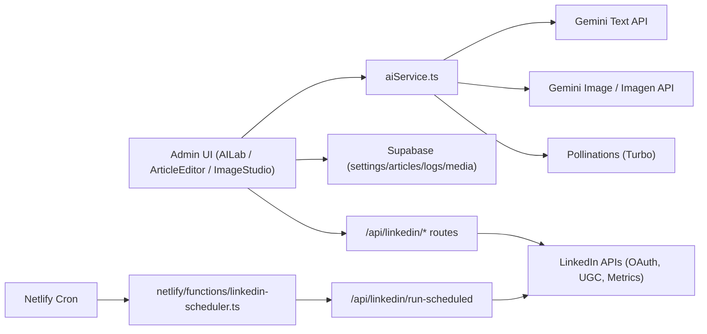

# AI Content Pipeline Playbook (Gemini + Image + LinkedIn)

Last updated: Feb 19, 2026

## Goal
This is the consolidated, implementation-ready reference for porting this project's AI content pipeline into another project.

It covers:
- multilingual Gemini article generation with parse/recovery safeguards
- AI image generation (Turbo + Gemini/Imagen) with storage/logging
- LinkedIn OAuth, direct sharing, scheduling, and metrics sync
- required settings keys, env vars, SQL tables, and deployment wiring

## Architecture At A Glance

## 1) Article Generation Pipeline (Gemini)

### Primary flow
1. Optional research pre-pass (`deep` mode) gathers sources/brief.
2. Generate one primary language article as strict JSON.
3. For additional languages, call translation per language with a strict JSON schema.
4. Merge fields, normalize HTML, fill missing fields, append sources.
5. Return a complete payload even if one translation leg fails.

Core implementation:
- `src/lib/aiService.ts` (`generateAIArticle`, `translateArticlePackage`, `getAIArticlePrompt`)
- `src/components/admin/AILab.tsx`

### Why this shape is used
- One-shot multi-language JSON responses are less stable.
- Single primary + per-language translation reduces parse failures and token waste.

Grounding/tooling note:
- Grounding can be disabled automatically in some runtime paths (for example, incompatible model/tool combinations and when deep research findings are already precompiled) to preserve strict JSON-mode reliability.

### Parse and recovery contract
Parsing is bounded:
1. direct JSON parse
2. bounded repair attempt
3. fallback recovery from raw output (no unbounded regenerate loops)

Recoverable errors include raw output so UI can salvage content:
- `RecoverableArticleGenerationError`
- `recoverAIArticleFromRawOutput(...)`

UI preserves recoverable output in localStorage and supports manual recovery:
- `src/components/admin/AILab.tsx`

### Prompt governance (admin-editable defaults)
Settings keys:
- `gemini_article_prompt_default_instructions`
- `gemini_article_prompt_slovak_native_instructions`
- `gemini_translation_prompt_default_instructions`

Runtime fallback defaults are centralized in:
- `src/lib/aiSettings.ts` (`AI_PROMPT_DEFAULTS`)

These defaults are used when DB settings are missing/empty and are exposed in:
- `src/components/admin/AISettings.tsx`

### Cost and usage controls
Preflight checks in AILab use:
- per-request USD cap
- daily/monthly token quotas
- daily/monthly USD quotas
- cooldown window

Usage and diagnostics logging:
- `ai_usage_logs` (token accounting)
- `ai_generation_logs` (request lifecycle diagnostics)

## 2) Image Generation Pipeline

### Engine routing
Unified helper:
- `src/lib/aiService.ts` -> `generateAIImage(...)`

Decision logic:
1. If `turbo` forced, use Pollinations Flux URL directly.
2. Else read `settings.image_model`.
   - `turbo` => Pollinations
   - any other value (`pro`/`gemini`) => Gemini/Imagen path
3. If Gemini path has no key, fallback to Turbo.
4. On Gemini errors, fallback to Turbo.

### Gemini/Imagen behavior
For Gemini/Imagen mode:
- API key resolution: `gemini_image_api_key` then `gemini_api_key`
- model resolution: explicit override, else `gemini_image_model`, else `imagen-3.0-generate-001`
- endpoint strategy:
  - Imagen-like models prefer `:predict`
  - non-Imagen models prefer `:generateContent` with image modalities
  - if primary endpoint fails, try alternate endpoint
- non-ASCII prompts for Imagen are translated to English first

### Turbo behavior
Turbo builds a deterministic Pollinations URL:
- width/height
- seed (explicit or random)
- model fixed to Flux

### Admin UX and storage
Image Studio:
- `src/components/admin/ImageStudio.tsx`
- template-driven prompt builder
- batch generation (1-6)
- engine/model override
- seed/aspect controls
- history and "reuse prompt"

Persistence:
- `image_generations` for run history
- `media_library` for curated saved assets
- `images` storage bucket for binary assets

Article Editor cover image generation also uses `generateAIImage(...)`:
- `src/components/admin/ArticleEditor.tsx`

## 3) LinkedIn Pipeline

### OAuth connect
Routes:
- `POST /api/linkedin/auth` (creates OAuth state, returns auth URL)
- `GET /api/linkedin/callback` (token exchange + account upsert)
- `POST /api/linkedin/disconnect`

Core helpers:
- `src/lib/linkedinApi.ts`

State tables:
- `linkedin_oauth_states`
- `linkedin_accounts`

### Direct share
Route:
- `POST /api/linkedin/share`

Supported modes:
- `article`: shares article URL (LinkedIn unfurls OG metadata)
- `image`: uploads image asset first, then creates UGC post

Supported targets:
- `member`
- `organization` (requires org scopes + resolved org URN)

Share logging:
- `linkedin_share_logs` (success + error with provider payload)

### Scheduled share
Queue route:
- `POST /api/linkedin/schedule` writes to `linkedin_share_queue`

Runner route:
- `POST /api/linkedin/run-scheduled`
- supports user-triggered run (Bearer token) and cron run (`x-scheduler-secret`)
- lock step: updates queue row to `processing` before posting

Cron function:
- `netlify/functions/linkedin-scheduler.ts`
- invokes `/api/linkedin/run-scheduled` with scheduler secret
- scheduled in `netlify.toml` as `*/10 * * * *`

### Status, discovery, and metrics
Routes:
- `GET /api/linkedin/status`
- `GET /api/linkedin/organizations`
- `GET /api/linkedin/logs`
- `GET /api/linkedin/logs-summary`
- `GET /api/linkedin/scheduled`
- `GET /api/linkedin/analytics`

Metrics helper:
- `src/lib/linkedinMetrics.ts`
- merges social actions + org share stats when scopes allow

## 4) Settings Registry (Supabase `settings`)

Use these keys for this pipeline:

### Article generation + guardrails
- `gemini_api_key`
- `gemini_model`
- `gemini_article_model`
- `gemini_article_thinking_budget`
- `gemini_request_budget_usd`
- `gemini_quota_daily_tokens`
- `gemini_quota_monthly_tokens`
- `gemini_quota_daily_usd`
- `gemini_quota_monthly_usd`
- `gemini_request_cooldown_seconds`
- `gemini_price_input_per_million`
- `gemini_price_output_per_million`
- `gemini_article_prompt_default_instructions`
- `gemini_article_prompt_slovak_native_instructions`
- `gemini_translation_prompt_default_instructions`

### Image generation
- `image_model` (`turbo` or non-turbo value like `pro`)
- `gemini_image_api_key`
- `gemini_image_model`

### LinkedIn
- `linkedin_default_org_urn`

Notes:
- Runtime currently interprets `image_model === "turbo"` as Turbo, otherwise Gemini/Imagen.
- Keep a unique index on `settings.key` (`supabase/fix_settings_and_linkedin_uniques.sql`).

## 5) Required Environment Variables

### Base app
- `NEXT_PUBLIC_SUPABASE_URL`
- `NEXT_PUBLIC_SUPABASE_ANON_KEY`
- `SUPABASE_SERVICE_ROLE_KEY` (recommended for server routes)
- `NEXT_PUBLIC_SITE_URL` (recommended canonical site URL)

### LinkedIn OAuth + API
- `LINKEDIN_CLIENT_ID`
- `LINKEDIN_CLIENT_SECRET`
- `LINKEDIN_REDIRECT_URI`
- `LINKEDIN_SCHEDULER_SECRET`
- `LINKEDIN_ENABLE_ORG_SCOPES` (`true` to request org scopes)
- `LINKEDIN_ENABLE_MEMBER_READ_SCOPE` (`true` to request `r_member_social`)
- `LINKEDIN_API_VERSION` (default fallback in code: `202601`)
- `LINKEDIN_DEFAULT_ORG_URN` (optional fallback)

### Netlify scheduler URL resolution (function fallback chain)
Used by `netlify/functions/linkedin-scheduler.ts`:
- `NEXT_PUBLIC_SITE_URL`
- `URL`
- `DEPLOY_PRIME_URL`
- `DEPLOY_URL`
- `SITE_URL`

## 6) Supabase SQL Bootstrap Order (Portable Setup)

Recommended minimum order:
1. Core content tables:
   - `supabase/articles.sql`
   - `supabase/tags.sql`
   - `supabase/article_tags.sql`
   - `supabase/settings.sql`
2. AI logging:
   - `supabase/ai_usage_logs.sql`
   - `supabase/ai_generation_logs.sql`
3. Media and image history:
   - `supabase/media_library.sql`
   - `supabase/image_generations.sql`
4. LinkedIn:
   - `supabase/linkedin_schema.sql`
   - `supabase/linkedin_share_queue.sql`
   - `supabase/linkedin_share_queue_upgrade.sql`
   - `supabase/linkedin_share_logs_upgrade.sql`
5. Data integrity + safety:
   - `supabase/fix_settings_and_linkedin_uniques.sql`
   - `supabase/security_rls_hardening_public_tables.sql` (if using same policy strategy)

## 7) API Surface Summary (for integration)

### Article / AI helpers (library-level)
- `generateAIArticle(...)`
- `generateAIOutline(...)`
- `generateAIResearchPack(...)`
- `recoverAIArticleFromRawOutput(...)`
- `generateAIImage(...)`
- `testGeminiConnection(...)`

### LinkedIn HTTP routes
- `POST /api/linkedin/auth`
- `GET /api/linkedin/callback`
- `POST /api/linkedin/disconnect`
- `GET /api/linkedin/status`
- `GET /api/linkedin/organizations`
- `POST /api/linkedin/share`
- `POST /api/linkedin/schedule`
- `POST /api/linkedin/run-scheduled`
- `GET /api/linkedin/scheduled`
- `GET /api/linkedin/logs`
- `GET /api/linkedin/logs-summary`
- `GET /api/linkedin/analytics`

## 8) Porting Checklist (New Project)

1. Copy core services:
   - `src/lib/aiService.ts`
   - `src/lib/aiSettings.ts`
   - `src/lib/linkedinApi.ts`
   - `src/lib/linkedinMetrics.ts`
2. Copy admin UIs as needed:
   - `src/components/admin/AILab.tsx`
   - `src/components/admin/AISettings.tsx`
   - `src/components/admin/ImageStudio.tsx`
   - LinkedIn areas in `src/components/admin/ArticleEditor.tsx` and `src/components/admin/LinkedInSettings.tsx`
3. Copy LinkedIn API routes under `src/app/api/linkedin/*`.
4. Apply SQL files in the bootstrap order above.
5. Configure env vars and scheduler.
6. Verify settings rows exist (or rely on defaults) and save via AI Settings once.
7. Run end-to-end validation:
   - generate multilingual article
   - trigger forced parse recovery path
   - generate and save image
   - connect LinkedIn, direct share, schedule share, run scheduler, sync metrics

## 9) Operational Guardrails

- Cap retries and avoid regenerate loops in one request cycle.
- Preserve recoverable raw text/image metadata so user value is never discarded.
- Use queue locking for scheduled LinkedIn processing.
- Log every generation/share attempt for observability.

## 10) Known Caveats

- Grounding/tool outputs are structurally less stable than strict JSON mode.
- Custom prompt one-shot multilingual formats can bypass reliability assumptions if they force all languages in one call.
- LinkedIn metrics can lag shortly after posting.
- Organization metrics require org scopes; member metrics may be limited without `r_member_social`.
- Current implementation reads Gemini keys from `settings` in client-accessible flows.
  - For stricter security in a new project, move Gemini calls behind server-side API routes.
