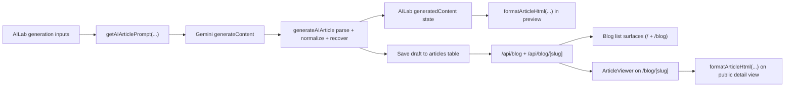

# Article Rendering Reference (Gemini -> Preview -> Public Blog)

Last updated: Feb 19, 2026

## Scope
This document explains how article rendering is implemented across three layers:

1. Gemini article creation prompt and post-processing contract.
2. Public website rendering (`/blog` list + `/blog/[slug]` detail).
3. Admin AI Lab article preview rendering.

## End-to-End Flow

---

## 1) Gemini Prompt Rendering Contract

Primary implementation:
- `src/lib/aiService.ts` (`getAIArticlePrompt`, `generateAIArticle`)
- `src/lib/aiSettings.ts` (`AI_PROMPT_DEFAULTS`, settings fallback keys)

### 1.1 Prompt-level output requirements
`getAIArticlePrompt(...)` enforces:

- Raw JSON only (no markdown wrappers, no extra commentary).
- One full field set per selected language:
  - `title_*`, `excerpt_*`, `content_*`, `meta_title_*`, `meta_description_*`, `meta_keywords_*`
- `content_*` must be HTML strings.
- Structured HTML rules for readability:
  - frequent `<h2>` and `<h3>`
  - `
`, `<ul>/<li>`, `<blockquote>`, `<strong>`, optional `<em>`
  - inline citations (`[1]`) when factual references are made
  - end section for sources (`<h3>` + `<ol>` with clickable `<a>`)
- Shared JSON fields:
  - `sources: [{ title, url }]`
  - `tags: string[]`
  - `slug`

### 1.2 Runtime defaults that influence prompt wording
Prompt defaults are configurable in `settings` table:

- `gemini_article_prompt_default_instructions`
- `gemini_article_prompt_slovak_native_instructions`
- `gemini_translation_prompt_default_instructions`

Fallback defaults live in `src/lib/aiSettings.ts` (`AI_PROMPT_DEFAULTS`).

### 1.3 Post-generation normalization before UI sees content
`generateAIArticle(...)` normalizes every `content_*` field:

1. `convertMarkdownToHtml(...)`
2. `normalizeArticleHtml(...)`
3. `addHeadingAnchors(...)`

Additional normalization:
- `fillMissingArticleFields(...)` ensures each selected language has title/excerpt/content/SEO fallback values.
- `normalizeSourceList(...)` deduplicates sources by URL.
- If content lacks a "Sources & References" section, sources HTML is appended automatically.

### 1.4 Multi-language reliability behavior
For `targetLanguages.length > 1` (and no custom full prompt override):

1. Generate one primary language package.
2. Translate package per extra language via `translateArticlePackage(...)`.
3. Merge fields and fill gaps.

If a translation call fails, that language receives primary-language fallback content to keep payload complete.

### 1.5 Parse and recovery behavior
Parse path inside `generateAIArticle(...)`:

1. Direct parse (`tryParseJson`)
2. JSON repair (`repairJsonWithGemini`) when allowed
3. On failure, bounded recovery from raw output (`recoverAIArticleFromRawOutput`)

If recovery still cannot produce structured JSON, `createRawFallbackArticle(...)` creates a usable HTML draft instead of dropping output.

---

## 2) Public Website Rendering

### 2.1 Blog list data (`/api/blog`)

Implementation:
- `src/app/api/blog/route.ts`
- `src/components/BlogCarousel.tsx`
- `src/app/blog/page.tsx`

Behavior:

- Only published articles are returned:
  - `is_published = true`
  - `published_at` is null or <= now
- API maps DB rows to list cards using fallback title/excerpt:
  - title fallback order: `title_sk -> title_en -> title_de -> title_cn`
  - excerpt fallback order: `excerpt_sk -> excerpt_en -> excerpt_de -> excerpt_cn`
- Also returns multilingual fields (`title_*`, `excerpt_*`) for future client-side language selection.

Rendering surfaces:

- Homepage carousel (`BlogCarousel`) fetches `/api/blog` client-side.
- Blog index page (`/blog`) fetches `/api/blog?limit=12` server-side.

Important: list cards render plain text title/excerpt; full article HTML is not rendered in list mode.

### 2.2 Blog detail data and rendering (`/blog/[slug]`)

Implementation:
- `src/app/api/blog/[slug]/route.ts`
- `src/app/blog/[slug]/page.tsx`
- `src/components/ArticleViewer.tsx`
- `src/lib/articleFormat.ts`

Behavior:

- API route fetches one published article by slug, returns full row plus legacy defaults (`title`, `html`, `feature_image`).
- Page loads article through API, generates metadata + JSON-LD, then renders `ArticleViewer`.
- `ArticleViewer` language selection:
  - current UI language first (from `LanguageContext`)
  - fallback order: `en -> sk -> de -> cn`
  - final legacy fallback: `post.html` / `post.content`

Then article content rendering pipeline is:

1. `rawContent = getField('content')`
2. `formatArticleHtml(rawContent)`
3. `dangerouslySetInnerHTML` in prose container

### 2.3 What `formatArticleHtml(...)` does

Implementation:
- `src/lib/articleFormat.ts`

If input already has structured HTML and DOM is available:
- Splits `
` blocks containing ` ` into separate paragraphs.
- Promotes heading-like paragraphs to `<h2>`/`<h3>`.
- Adds anchor links to `<h2>/<h3>` headings.

If input is plain text:
- Converts lines into `
`, `<ul>/<li>`, `<blockquote>`, and heading blocks heuristically.
- Adds heading anchors.

Note: this helper formats structure for display; it is not an HTML sanitizer.

---

## 3) Admin AI Lab Preview Rendering

Implementation:
- `src/components/admin/AILab.tsx`
- `src/lib/articleFormat.ts`
- `src/lib/aiService.ts` (`recoverAIArticleFromRawOutput`, `hasRecoverableArticleOutput`)

### 3.1 Preview data source

- Successful generation sets `generatedContent` from `generateAIArticle(...)`.
- Language tabs choose `activeTab` (`sk`, `en`, optional `de`, `cn` if available).
- Preview body renders:
  - `formatArticleHtml(generatedContent["content_${activeTab}"])`
  - then `dangerouslySetInnerHTML`

Fallback preview message for missing tab content:
- `
No content generated for this language.
`

### 3.2 Sources and SEO panel behavior

- Sources are shown in a separate block from `generatedContent.sources`.
- SEO preview reads `meta_title_*`, `meta_description_*`, `meta_keywords_*` for active tab.
- Token usage/cost cards render from `generatedContent.usage`.

### 3.3 Parse-failure recovery UX in preview panel

When generation fails with recoverable raw output:

1. `hasRecoverableArticleOutput(error)` captures raw text + source hints.
2. Raw payload is kept in state and localStorage key:
   - `ai_lab_recoverable_article_output_v1`
3. UI shows recovery controls:
   - Recover & Preview
   - View/Edit raw output
   - Copy
   - Dismiss
4. Recover action calls `recoverAIArticleFromRawOutput(...)` and repopulates `generatedContent`.

Result: admins can salvage already-generated output without re-running expensive model calls.

---

## 4) Key Differences To Remember

1. Blog list surfaces currently use API fallback title/excerpt, not language-context selection.
2. Blog detail view is language-aware via `LanguageContext` + per-field fallbacks.
3. Preview and detail both share `formatArticleHtml(...)`, which keeps rendering behavior aligned.
4. Prompt enforces HTML output, but runtime normalization still runs to correct markdown/plain-text drift.

## 5) File Map (Quick Reference)

- Prompt + generation + recovery:
  - `src/lib/aiService.ts`
- Prompt defaults/settings:
  - `src/lib/aiSettings.ts`
- Shared article formatter:
  - `src/lib/articleFormat.ts`
- Admin generation preview:
  - `src/components/admin/AILab.tsx`
- Public blog list API:
  - `src/app/api/blog/route.ts`
- Public blog detail API:
  - `src/app/api/blog/[slug]/route.ts`
- Public list page:
  - `src/app/blog/page.tsx`
- Public detail page:
  - `src/app/blog/[slug]/page.tsx`
- Public detail renderer:
  - `src/components/ArticleViewer.tsx`
- Homepage list carousel:
  - `src/components/BlogCarousel.tsx`
