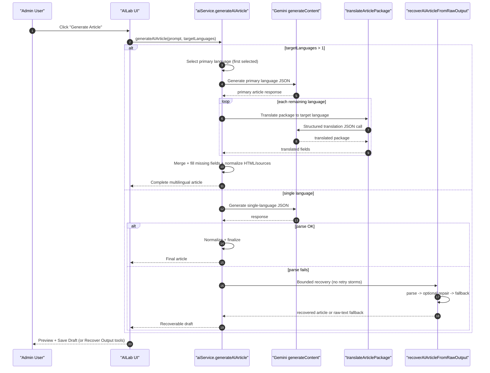

# Gemini Article Generation Playbook (Reusable)

Last updated: Feb 19, 2026

## Why This Exists
This guide documents the production approach used in Skallars Spirograph to make Gemini-based article generation reliable, cost-bounded, and recoverable.

Use this playbook in future projects when you need:
- multilingual article generation
- grounding/research support
- strict JSON persistence into a CMS/database
- predictable token spend

## Core Problems Solved
1. **Large multilingual JSON payloads are fragile**:
   - Asking one model response to include SK/EN/DE/CN in one JSON object frequently breaks structure.
2. **Repair calls are not guaranteed**:
   - JSON repair outputs can also be malformed.
3. **Retry cascades waste tokens**:
   - “Regenerate until parse succeeds” can quickly create request storms.
4. **Generated content gets lost**:
   - If strict parsing fails and raw output is discarded, user value is lost.

## Reliability Architecture

## End-to-End Sequence (Mermaid)


## 1) Generate One Primary Language First
- Generate only one language (for example `sk`) as structured JSON.
- Keep model output smaller and parseable.

Implementation reference:
- `src/lib/aiService.ts` -> `generateAIArticle(...)`

## 2) Translate Package Per Language
- Translate the primary article package (`title`, `excerpt`, `content`, SEO fields) into each additional language with a dedicated JSON schema.
- Run one structured translation call per target language.

Implementation reference:
- `src/lib/aiService.ts` -> `translateArticlePackage(...)`
- `src/lib/aiService.ts` -> `getArticleTranslationResponseSchema(...)`

## 3) Merge + Normalize
- Merge translated fields into final article payload.
- Normalize HTML + anchors.
- Deduplicate and append sources.
- Fill missing fields deterministically so UI never receives “sources-only” payloads.

Implementation reference:
- `src/lib/aiService.ts` -> `fillMissingArticleFields(...)`
- `src/lib/aiService.ts` -> `normalizeSourceList(...)`
- `src/lib/aiService.ts` -> `addHeadingAnchors(...)`

## 4) Bounded Recovery (No Retry Storms)
- Never run unbounded generate/regenerate loops.
- If parse fails:
  - attempt cheap local/repair parsing once (bounded)
  - if still invalid, return fallback content from raw output
- Guarantee a usable draft is returned whenever possible.

Implementation reference:
- `src/lib/aiService.ts` -> `recoverAIArticleFromRawOutput(...)`
- `src/lib/aiService.ts` -> `createRawFallbackArticle(...)`

## 5) Preserve Recoverable Output in UI
- Keep raw recoverable text in client state + localStorage.
- Offer `Recover`, `View Raw Output`, `Copy`, and `Dismiss`.
- Do not force user to re-spend tokens after a parse failure.

Implementation reference:
- `src/components/admin/AILab.tsx`

## 6) Prompt Governance (Non-Code Tuning)
- Expose admin-editable default instructions in settings to avoid hardcoding tone/style forever.
- Recommended keys:
  - `gemini_article_prompt_default_instructions`
  - `gemini_article_prompt_slovak_native_instructions`
  - `gemini_translation_prompt_default_instructions`
- Apply them at runtime in generation + translation prompt builders.
- Mirror them in prompt-preview UI so operators see effective prompt text before generation.

### Production Default Prompt Text (Current App)
These defaults are now used as runtime fallback and in AI Settings initialization.

`gemini_article_prompt_default_instructions`:
```text
Write with senior legal-advisory clarity for Central European business clients.
Prioritize concrete implications, obligations, risks, and practical next steps.
Avoid filler and generic AI phrasing.
Use concise paragraphs and precise wording.
```

`gemini_article_prompt_slovak_native_instructions`:
```text
Píš prirodzenou, súčasnou slovenčinou používanej v právnej a biznis komunikácii na Slovensku.
Vyhni sa doslovným kalkom z angličtiny a neprirodzeným prekladovým väzbám.
Uprednostni idiomatické formulácie, prirodzený slovosled a terminológiu zaužívanú v slovenskej právnej praxi.
Tonálne: odborné, vecné, dôveryhodné; bez marketingového pátosu.
```

`gemini_translation_prompt_default_instructions`:
```text
Translate for native readability and legal precision, not literal sentence mapping.
Preserve meaning, legal nuance, HTML structure, links, and citations.
Prefer target-language idioms and professional register used by local legal practitioners.
```

## Token Budgeting Rules (Recommended)
1. Hard-cap generation attempts per click.
2. Prefer deterministic transforms (parse/repair/fill) over new generation calls.
3. Keep grounding path bounded; avoid additional generation passes after malformed output.
4. Use per-request budget and quota checks before dispatch.

## Suggested Request Pattern
For N languages:
- 1 primary generation call
- N-1 translation calls
- optional bounded repair calls only when needed

Avoid:
- repeated re-generation fallback prompts in same request cycle
- “retry until parse succeeds” loops

## Error Handling Contract
Use a recoverable error type carrying raw output and context so UI can salvage:
- `code`: recoverable category (example: `ARTICLE_OUTPUT_RECOVERABLE`)
- `rawOutput`: last model text
- `targetLanguages`
- discovered source URLs/titles

Implementation reference:
- `src/lib/aiService.ts` -> `RecoverableArticleGenerationError`

## Integration Checklist for New Projects
1. Define strict JSON schemas for generation and translation payloads.
2. Implement single-language generation + per-language translation.
3. Implement parse pipeline: direct parse -> bounded repair -> fallback.
4. Always preserve recoverable raw output.
5. Add UI affordance to recover without new generation.
6. Add request quotas/budget guardrails before calling model APIs.
7. Log usage and failures with request IDs for diagnostics.

## Known Caveats
- Grounding/tool outputs are structurally less stable than schema-only JSON mode.
- If translation for a language fails, fallback may copy primary-language text to keep payload complete.
- Custom prompt modes should be tested carefully in multilingual scenarios; they can bypass reliability assumptions if they enforce multi-language one-shot formatting.

## Minimal Pseudocode
```ts
if (targetLanguages.length > 1) {
  primary = generateArticle(targetLanguages=[primaryLang])
  for lang in otherLanguages:
    translated[lang] = translatePackage(primary, lang)
  article = merge(primary, translated)
  return normalizeAndFill(article)
}

try {
  out = generateArticle(targetLanguages=[singleLang])
  return parseAndNormalize(out)
} catch {
  return recoverFromRawOutputBounded(out.rawText)
}
```

## Files to Copy When Porting This Pattern
- `src/lib/aiService.ts` (generation + translation + recovery primitives)
- `src/components/admin/AILab.tsx` (recoverable output UX)
- settings/usage logging paths:
  - `settings` table keys for model + budget
  - `ai_usage_logs`
  - `ai_generation_logs`
